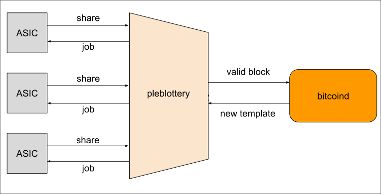

# pleblottery

A [StratumV2 Reference Implementation](https://stratumprotocol.org)-based hashrate aggregator for a pleb-friendly solo/lottery Bitcoin mining experience.

`pleblottery` is somewhat similar to [`public-pool.io`](https://web.public-pool.io/) and [`solo.ckpool.org`](https://solo.ckpool.org/), but built with SV2 since its inception.

Basically some pleb miner can point their multiple ASIC devices to `pleblottery`, which is responsible for:
- properly allocating the hashing space on separate jobs to each ASIC, proportionally to its hashrate.
- aggregating the hashrate of all ASICs into a solo mining "lottery ticket".

The main goal of this project is to explore the APIs provided by SRI. The authors wish to get familiarity with the codebase
and potentially propose improvements.

Currently, two different architectures are being explored:
- Consuming high-level `roles` APIs: a pretty straightforward integration of `pool_sv2` and `translator_sv2` crates.
  A functional implementation of this architecture is currently living on the `main` branch of the repo. It is however suboptimal,
because different threads under the same process communicate via TCP sockets.
- Consuming low-level APIs: instead of using `roles`, this architecture proposes a `Lottery` object built with low level SRI libraries. A much
more elegant implementation, however heavier-lifting. There's a WIP under `low-level-impl` branch.

## Instructions

soon™